# Lyra Rose: MVP Roadmap

|           | Status                              | Next Up                              | Blocked                          |
| --------- | ----------------------------------- | ------------------------------------ | -------------------------------- |
| **Data**  | Schema + storage migrations applied | Seed considered shards (Redwall set) | —                                |
| **Rend**  | E2e render verified                 | Renderer registry contract test      | —                                |
| **Field** | Drift / density / parallax / sky    | Tune density logic, profile motion   | —                                |
| **Open**  | OpenedShard component scaffolded    | Click-outside, escape, blurred drift | Backdrop-filter perf budget      |
| **Input** | Pointer + touch-attention modules   | Real touch-grammar design pass       | Touch grammar decisions          |
| **Audio** | Proximity gain + effect sounds      | Touch audio-summons equivalent       | Touch grammar decisions          |
| **Polish**| Meta description, favicon, OG card  | OG card editorial pass, perf profile | —                                |
| **Capt**  | Deferred (post-MVP)                 | Catch endpoint design                | MVP must ship first              |

---

## Contents

- [Milestones](#milestones)
  - [Milestone 1: Data & Renderers](#m1)
  - [Milestone 2: Field & Sky](#m2)
  - [Milestone 3: Opening & Touch](#m3)
  - [Milestone 4: Polish & Ship](#m4)
  - [Milestone 5: Capture Pipeline (post-MVP)](#m5)
- [Progress Map](#map)
- [Links](#links)
- [Beyond MVP](#post-mvp)

---

<a name="m1"><h3>Milestone 1: Data & Renderers</h3></a>

> [!IMPORTANT]
> **Goal:** A single shard with interior content can be authored in the database, fetched, and rendered through both surface and interior renderers. Proves the pluggable architecture end-to-end on a static page.

<a name="m1-doing"><h4>In Progress (Milestone 1)</h4></a>

_None._

<a name="m1-todo"><h4>To Do (Milestone 1)</h4></a>

- [ ] 1DA.3. Seed initial considered shards (Redwall + small companion set) — **depends on 1DA.1**
- [ ] 1DA.4. Storage upload workflow notes (which bucket, naming, alt-text discipline) — **depends on 1DA.2**
- [x] 1RE.3. End-to-end render verification: fetch shard → surface → open → interior → paginate
- [ ] 1RE.4. Renderer registry contract test (unknown surface/interior types fail gracefully) — **depends on 1RE.1, 1RE.2**

<a name="m1-blocked"><h4>Blocked (Milestone 1)</h4></a>

_None._

<a name="m1-done"><h4>Completed (Milestone 1)</h4></a>

- [x] 1DA.1. `shards` table schema (surface/interior discriminated columns, audio path, tending notes)
- [x] 1DA.2. Supabase Storage bucket + RLS policies for shard assets
- [x] 1RE.1. Still-image surface renderer
- [x] 1RE.2. Paginated-text interior renderer
- [x] 1RE.5. Renderer registries module
- [x] 1RE.6. Core types (`Shard`, `FieldShard`, discriminated unions)

---

<a name="m2"><h3>Milestone 2: Field & Sky</h3></a>

> [!IMPORTANT]
> **Goal:** The drifting field exists as the public surface. Shards drift at varied depths with parallax; density varies by its own logic; the sky shifts with the visitor's local time. Pointer interactions slow shards on hover.

<a name="m2-doing"><h4>In Progress (Milestone 2)</h4></a>

_None._

<a name="m2-todo"><h4>To Do (Milestone 2)</h4></a>

- [ ] 2FI.5. Tune density logic against a populated shard set — **depends on 1DA.3**
- [ ] 2FI.6. Non-deterministic replacement when a shard drifts off-screen (0/1/many at varied depths)
- [ ] 2FI.7. Profile drift performance with 10–20 simultaneous animations (GSAP, GPU transforms)
- [ ] 2FI.8. Cross-device sky-cycle verification (timezone correctness on mobile + desktop)
- [ ] 2IN.3. Hover-slowdown tuning pass (feel, not just function) — **depends on 2FI.7**

<a name="m2-blocked"><h4>Blocked (Milestone 2)</h4></a>

_None._

<a name="m2-done"><h4>Completed (Milestone 2)</h4></a>

- [x] 2FI.1. Drift module (varied-depth parallax, viewport-bounded motion)
- [x] 2FI.2. Density logic module
- [x] 2FI.3. Broken-mirror shard shape generator
- [x] 2FI.4. Day-cycle sky background (local-time driven)
- [x] 2IN.1. Pointer input module
- [x] 2IN.2. Touch-attention input module (initial pass)
- [x] 2RE.7. Viewport, Shard, OpenedShard component containers
- [x] 2RE.8. Main `+page.svelte` composition + server-side shard fetch

---

<a name="m3"><h3>Milestone 3: Opening & Touch</h3></a>

> [!IMPORTANT]
> **Goal:** A shard opens on click; the rest of the field continues drifting, blurred, behind it. Click-outside dismisses; escape key works. Touch grammar is its own designed inhabitation, not a port.

<a name="m3-doing"><h4>In Progress (Milestone 3)</h4></a>

_None._

<a name="m3-todo"><h4>To Do (Milestone 3)</h4></a>

- [ ] 3OP.1. Open transition: hover-slow → click → foreground placement (GSAP) — **depends on 2IN.3**
- [ ] 3OP.2. Blurred-but-drifting backdrop (`backdrop-filter` on continuously transforming layer) — **depends on 2FI.7**
- [ ] 3OP.3. Click-outside dismissal
- [ ] 3OP.4. Escape-key dismissal (a11y)
- [ ] 3OP.5. Surface-only shards open at larger scale with nothing else in frame
- [ ] 3OP.6. Shards-with-interior open to the renderer's output
- [ ] 3OP.7. Backdrop-filter performance budget + profile pass — **depends on 3OP.2**
- [ ] 3TO.1. Touch grammar design decision: noticing-without-committing mechanism
- [ ] 3TO.2. Touch grammar design decision: audio-summons-by-attention non-cursor analogue
- [ ] 3TO.3. Implement chosen touch grammar across field — **depends on 3TO.1, 3TO.2**
- [ ] 3TO.4. Implement chosen touch grammar across opening — **depends on 3TO.1, 3OP.1**
- [ ] 3AU.1. Pointer-proximity audio summons end-to-end test — **depends on 1DA.3**
- [ ] 3AU.2. Touch audio-summons equivalent — **depends on 3TO.2**
- [ ] 3AU.3. Expand/collapse effect sounds wired into open/close transitions — **depends on 3OP.1**

<a name="m3-blocked"><h4>Blocked (Milestone 3)</h4></a>

- [ ] 3OP.8. Cross-grammar regression sweep (pointer + touch parity test) — **depends on 3OP.4, 3TO.3, 3TO.4**

<a name="m3-done"><h4>Completed (Milestone 3)</h4></a>

- [x] 3AU.4. Web Audio proximity gain + effect sound primitives

---

<a name="m4"><h3>Milestone 4: Polish & Ship</h3></a>

> [!IMPORTANT]
> **Goal:** The site is recognisably the work, performant, indexable, and live at a chosen URL. Editorial design of the search-result surface (the only place the site speaks in language) is deliberate, not default.

<a name="m4-doing"><h4>In Progress (Milestone 4)</h4></a>

_None._

<a name="m4-todo"><h4>To Do (Milestone 4)</h4></a>

- [ ] 4PO.4. Editorial pass on OG card image (the considered public face)
- [ ] 4PO.5. Editorial pass on meta description + page title
- [ ] 4PO.6. Replace temporary favicon with considered version
- [ ] 4PO.7. URL decision (plain / considered / part of the meaning) and DNS setup
- [ ] 4PO.8. Final favicon + apple-touch-icon set — **depends on 4PO.6**
- [ ] 4PO.9. Performance audit (Lighthouse, INP, motion under load) — **depends on 3OP.7**
- [ ] 4PO.10. Accessibility audit (escape key, alt text, reduced-motion preference) — **depends on 3OP.4**
- [ ] 4PO.11. `prefers-reduced-motion` handling for drift + open transitions
- [ ] 4PO.12. Vercel production deploy + custom domain bind — **depends on 4PO.7**
- [ ] 4PO.13. Indexability check (robots.txt, sitemap, OG validators) — **depends on 4PO.4, 4PO.5**
- [ ] 4PO.14. End-to-end MVP success-test: author → display → open → paginate → dismiss, in pointer **and** touch — **depends on 3OP.8, 3TO.4**

<a name="m4-blocked"><h4>Blocked (Milestone 4)</h4></a>

_None._

<a name="m4-done"><h4>Completed (Milestone 4)</h4></a>

- [x] 4PO.1. Initial meta description shipped
- [x] 4PO.2. Temporary favicon
- [x] 4PO.3. Preview card image (initial)

---

<a name="m5"><h3>Milestone 5: Capture Pipeline (post-MVP)</h3></a>

> [!IMPORTANT]
> **Goal:** Frictionless capture into the collection from any client. Browser extension is one client; the catch endpoint accepts input from a phone shortcut, PWA, or anything else. Tending becomes optional enrichment, never a gate.

<a name="m5-doing"><h4>In Progress (Milestone 5)</h4></a>

_None._

<a name="m5-todo"><h4>To Do (Milestone 5)</h4></a>

- [ ] 5DA.5. Catch endpoint API design (auth, payload shape, idempotency) — **depends on 4PO.14**
- [ ] 5DA.6. OpenGraph metadata fetch service (server-side preview archival)
- [ ] 5DA.7. Asset archival into Supabase Storage at capture time — **depends on 5DA.6**
- [ ] 5DA.8. Catch endpoint implementation — **depends on 5DA.5, 5DA.7**
- [ ] 5DA.9. Browser extension MVP (one-click send: link / image / quote) — **depends on 5DA.8**
- [ ] 5DA.10. Immediate-regret undo on most recent capture (extension-side) — **depends on 5DA.9**
- [ ] 5DA.11. Phone shortcut client (iOS Shortcuts) — **depends on 5DA.8**
- [ ] 5DA.12. Co-contributor access path for Harriet's device — **depends on 5DA.8**
- [ ] 5RE.9. Custom Tend UI (private, replaces Supabase Studio stopgap) — **depends on 5DA.8**
- [ ] 5RE.10. Considered-deletion flow inside Tend UI — **depends on 5RE.9**

<a name="m5-blocked"><h4>Blocked (Milestone 5)</h4></a>

_None._

<a name="m5-done"><h4>Completed (Milestone 5)</h4></a>

_None._

---

## Progress Map

```mermaid
---
title: Progress Map
---
graph TD

m1{"`**Milestone 1**<br/>Data & Renderers`"}:::mile
m2{"`**Milestone 2**<br/>Field & Sky`"}:::mile
m3{"`**Milestone 3**<br/>Opening & Touch`"}:::mile
m4{"`**Milestone 4**<br/>Polish & Ship`"}:::mile
m5{"`**Milestone 5**<br/>Capture Pipeline`"}:::mile

1DA.1["`*1DA.1*<br/>**Data**<br/>shards schema`"]:::done
1DA.2["`*1DA.2*<br/>**Data**<br/>storage RLS`"]:::done
1DA.3["`*1DA.3*<br/>**Data**<br/>seed shards`"]:::open
1DA.4["`*1DA.4*<br/>**Data**<br/>upload workflow notes`"]:::open
1RE.1["`*1RE.1*<br/>**Rend**<br/>still-image surface`"]:::done
1RE.2["`*1RE.2*<br/>**Rend**<br/>paginated-text interior`"]:::done
1RE.3["`*1RE.3*<br/>**Rend**<br/>e2e render verify`"]:::done
1RE.4["`*1RE.4*<br/>**Rend**<br/>registry contract test`"]:::open
1RE.5["`*1RE.5*<br/>**Rend**<br/>registries module`"]:::done
1RE.6["`*1RE.6*<br/>**Rend**<br/>core types`"]:::done

2FI.1["`*2FI.1*<br/>**Field**<br/>drift + parallax`"]:::done
2FI.2["`*2FI.2*<br/>**Field**<br/>density logic`"]:::done
2FI.3["`*2FI.3*<br/>**Field**<br/>shard shape`"]:::done
2FI.4["`*2FI.4*<br/>**Field**<br/>sky cycle`"]:::done
2FI.5["`*2FI.5*<br/>**Field**<br/>tune density`"]
2FI.6["`*2FI.6*<br/>**Field**<br/>non-det replacement`"]:::open
2FI.7["`*2FI.7*<br/>**Field**<br/>drift perf profile`"]:::open
2FI.8["`*2FI.8*<br/>**Field**<br/>tz sky verify`"]:::open
2IN.1["`*2IN.1*<br/>**Input**<br/>pointer module`"]:::done
2IN.2["`*2IN.2*<br/>**Input**<br/>touch-attention init`"]:::done
2IN.3["`*2IN.3*<br/>**Input**<br/>hover-slow tune`"]
2RE.7["`*2RE.7*<br/>**Rend**<br/>Viewport/Shard/Opened`"]:::done
2RE.8["`*2RE.8*<br/>**Rend**<br/>+page composition`"]:::done

3OP.1["`*3OP.1*<br/>**Open**<br/>open transition`"]
3OP.2["`*3OP.2*<br/>**Open**<br/>blurred backdrop`"]
3OP.3["`*3OP.3*<br/>**Open**<br/>click-outside`"]:::open
3OP.4["`*3OP.4*<br/>**Open**<br/>escape key`"]:::open
3OP.5["`*3OP.5*<br/>**Open**<br/>surface-only at scale`"]:::open
3OP.6["`*3OP.6*<br/>**Open**<br/>interior renderer mount`"]:::open
3OP.7["`*3OP.7*<br/>**Open**<br/>backdrop perf budget`"]
3OP.8["`*3OP.8*<br/>**Open**<br/>cross-grammar sweep`"]
3TO.1["`*3TO.1*<br/>**Touch**<br/>noticing-without-committing`"]:::open
3TO.2["`*3TO.2*<br/>**Touch**<br/>audio-summons analogue`"]:::open
3TO.3["`*3TO.3*<br/>**Touch**<br/>field touch grammar`"]
3TO.4["`*3TO.4*<br/>**Touch**<br/>opening touch grammar`"]
3AU.1["`*3AU.1*<br/>**Audio**<br/>pointer summons e2e`"]
3AU.2["`*3AU.2*<br/>**Audio**<br/>touch summons equiv`"]
3AU.3["`*3AU.3*<br/>**Audio**<br/>expand/collapse fx`"]
3AU.4["`*3AU.4*<br/>**Audio**<br/>proximity primitives`"]:::done

4PO.1["`*4PO.1*<br/>**Polish**<br/>meta description (initial)`"]:::done
4PO.2["`*4PO.2*<br/>**Polish**<br/>temp favicon`"]:::done
4PO.3["`*4PO.3*<br/>**Polish**<br/>preview card (initial)`"]:::done
4PO.4["`*4PO.4*<br/>**Polish**<br/>OG card editorial`"]:::open
4PO.5["`*4PO.5*<br/>**Polish**<br/>meta + title editorial`"]:::open
4PO.6["`*4PO.6*<br/>**Polish**<br/>final favicon decision`"]:::open
4PO.7["`*4PO.7*<br/>**Polish**<br/>URL decision`"]:::open
4PO.8["`*4PO.8*<br/>**Polish**<br/>icon set`"]
4PO.9["`*4PO.9*<br/>**Polish**<br/>perf audit`"]
4PO.10["`*4PO.10*<br/>**Polish**<br/>a11y audit`"]
4PO.11["`*4PO.11*<br/>**Polish**<br/>reduced-motion`"]:::open
4PO.12["`*4PO.12*<br/>**Polish**<br/>prod deploy + DNS`"]
4PO.13["`*4PO.13*<br/>**Polish**<br/>indexability check`"]
4PO.14["`*4PO.14*<br/>**Polish**<br/>MVP success test`"]

5DA.5["`*5DA.5*<br/>**Capt**<br/>catch endpoint design`"]
5DA.6["`*5DA.6*<br/>**Capt**<br/>OG fetch service`"]:::open
5DA.7["`*5DA.7*<br/>**Capt**<br/>asset archival`"]
5DA.8["`*5DA.8*<br/>**Capt**<br/>catch endpoint impl`"]
5DA.9["`*5DA.9*<br/>**Capt**<br/>browser extension`"]
5DA.10["`*5DA.10*<br/>**Capt**<br/>regret undo`"]
5DA.11["`*5DA.11*<br/>**Capt**<br/>phone shortcut`"]
5DA.12["`*5DA.12*<br/>**Capt**<br/>Harriet co-contrib`"]
5RE.9["`*5RE.9*<br/>**Capt**<br/>custom Tend UI`"]
5RE.10["`*5RE.10*<br/>**Capt**<br/>considered deletion`"]

%% Milestone grouping
1DA.1 --> m1
1DA.2 --> m1
1DA.3 --> m1
1DA.4 --> m1
1RE.1 --> m1
1RE.2 --> m1
1RE.3 --> m1
1RE.4 --> m1
1RE.5 --> m1
1RE.6 --> m1
2FI.1 --> m2
2FI.5 --> m2
2FI.6 --> m2
2FI.7 --> m2
2IN.3 --> m2
3OP.1 --> m3
3OP.7 --> m3
3OP.8 --> m3
3TO.3 --> m3
3TO.4 --> m3
3AU.1 --> m3
3AU.2 --> m3
3AU.3 --> m3
4PO.9 --> m4
4PO.12 --> m4
4PO.14 --> m4
5DA.8 --> m5
5DA.9 --> m5
5RE.9 --> m5

%% Task dependencies
1DA.1 --> 1DA.3
1DA.2 --> 1DA.4
1RE.1 --> 1RE.4
1RE.2 --> 1RE.4

1DA.3 --> 2FI.5
2FI.7 --> 2IN.3

2IN.3 --> 3OP.1
2FI.7 --> 3OP.2
3OP.2 --> 3OP.7
3TO.1 --> 3TO.3
3TO.2 --> 3TO.3
3TO.1 --> 3TO.4
3OP.1 --> 3TO.4
3OP.4 --> 3OP.8
3TO.3 --> 3OP.8
3TO.4 --> 3OP.8
1DA.3 --> 3AU.1
3TO.2 --> 3AU.2
3OP.1 --> 3AU.3

4PO.6 --> 4PO.8
3OP.7 --> 4PO.9
3OP.4 --> 4PO.10
4PO.7 --> 4PO.12
4PO.4 --> 4PO.13
4PO.5 --> 4PO.13
3OP.8 --> 4PO.14
3TO.4 --> 4PO.14

4PO.14 --> 5DA.5
5DA.6 --> 5DA.7
5DA.5 --> 5DA.8
5DA.7 --> 5DA.8
5DA.8 --> 5DA.9
5DA.9 --> 5DA.10
5DA.8 --> 5DA.11
5DA.8 --> 5DA.12
5DA.8 --> 5RE.9
5RE.9 --> 5RE.10

classDef default fill:#fff7fb;
classDef open fill:#fff9e5;
classDef done fill:#d6f5d6;
classDef mile fill:#c4fffe;
```

---

## Links

- [Vision](../VISION.md)
- [Tech Stack](../TECH-STACK.md)
- [Deferred Features and Decisions](../DEFERRED.md)

---

## Beyond MVP

Captured separately in [DEFERRED.md](../DEFERRED.md). Headlines:

- Additional surface renderers (looping video, subtle animation, others)
- Additional interior renderers (sub-shard field, image sequence, small interactive thing)
- Surface motion architecture decision (which non-still surfaces ship first, when)
- Capture pipeline (Milestone 5 above) — moves from Beyond-MVP into active scope once MVP is live
